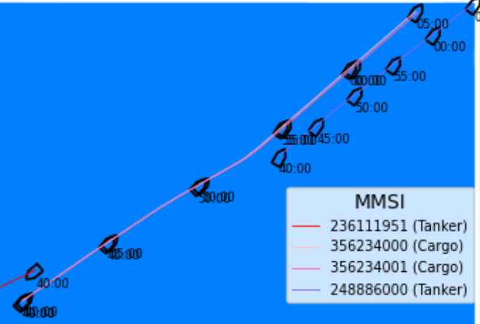
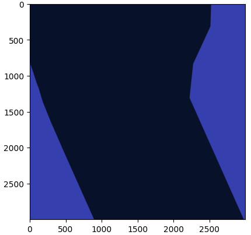

## Reinforcement Learning and Inverse Optimization for Autonomous Navigation

## Special course - Fall 2023
Rolando Esquivel-Sancho

---
## Week 9 - 27-02-2024:

* Reviewing literature mainly in inverse RL, RL with human feedback and COLREG-compliant collision avoidance.

* Exploring the Data:
    * Question? Land.pickle returning empty list.
    * Question? Depth.pickle vrs depth data in seachart.json.

* Structuring the Python Package:
    * Defining modules and classes for data processing, analysis, and environment implementation.

---
## Week 10 - 04-03-2024:

Imitation library: https://imitation.readthedocs.io/en/latest/#

Algorithms:
* Behavioral Cloning (Policy *)
* Generative Adversarial Imitation Learning (Policy *)
* Adversarial Inverse Reinforcement Learning (Policy, recovers reward func *)
* DAgger (Policy similar to BC but online *)
* Density-Based Reward Modeling (Reward function no interpretable *)
* Maximum Causal Entropy Inverse Reinforcement Learning (Reward *)
* Preference Comparison (Reward)
* Soft Q Imitation Learning (Policy DQN)

---
Topics & next steps
* Create the env with Gymnasium's API
* Actions:
    * Used sog and cog as action vector and keep lon and lat as observations.
    * create the dynamic model.
* Observations:
    * Model as a multiagent systems.
    * Fix number of dynamic objects.
    * observation horizon.
* Limitations on Horizon Length
* Trajectories to Transitions.
* Metrics

---
## Week 11 - 12-03-2024:

#### Status:
* action space: `Box(-1, 1, (2,), float32)` -- normalization (max-speed)

* observation space: `Box(0, 255, (W, H), np.uint8)` and `Box(-1, 1, (n_vessels,4), np.uint8)`

---
* Using the agent accions COG (radians) and SOG (m/s) to generate location.

 

---
#### Next steps
* Create Land/Depth observation relative to the agent
* Create trajectory metric.

---
## Week 12 - 19-03-2024:

* Create Land/Depth observation relative to the agent
Scenario 5 meters per pixel.
Transformation:
  

---

#### Next steps
* Create trajectory metric.
* Start the implementation of IRL 

Comments: 
* along track error
* cross track error
* tracking the frames

---
## Week 14 - 02-04-2024:

Croping using polygons and then conver to matrix, filling missing areas with nearest pixel value:
 

---
### Pygame representation:

Renderization with pygame:

--- 

#### Next steps
* Fix aspect ratio, some scenarios are not square
* Reading material:
    * DAgger: https://arxiv.org/pdf/1011.0686.pdf
    * IRL without RL: https://arxiv.org/pdf/2303.14623.pdf
    * Situational Awareness: https://backend.orbit.dtu.dk/ws/files/338331238/PhD_thesis_260_sider_-_76_farvede.pdf
* Create trajectory metric. **
* Start the implementation of IRL **

---

## Week 16 - 16-04-2024:

* Observation matrix bug --> the polygons were not property rotated.
* sllib bug lat-long (scenario_to_vessel_states_and_lands_north_east).
* Reading material - GAIL: https://arxiv.org/pdf/1606.03476.pdf

* Report: https://www.overleaf.com/project/6605419761cb289c0b4f724a

---
Follow established maritime routes:

---

## Week 19 - 07-05-2024:

---
## overpy
`api = overpy.Overpass()`

---

Next steps:
- Use the overpy data (nodes and ways) directly in the observation matrix
- Handle the ships as a fixed list.
- Reading material - AIRL: https://arxiv.org/pdf/1710.11248